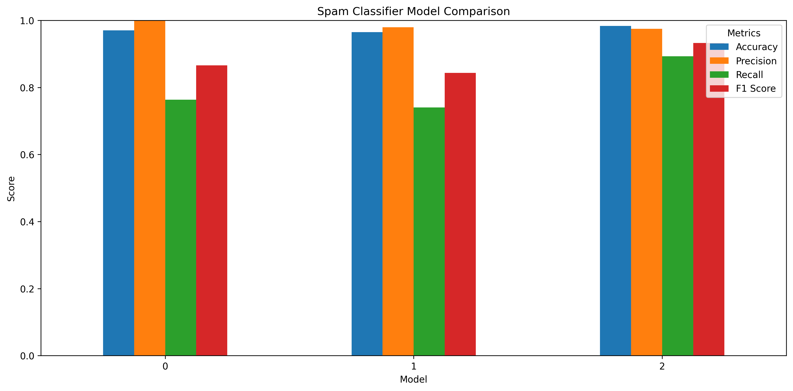
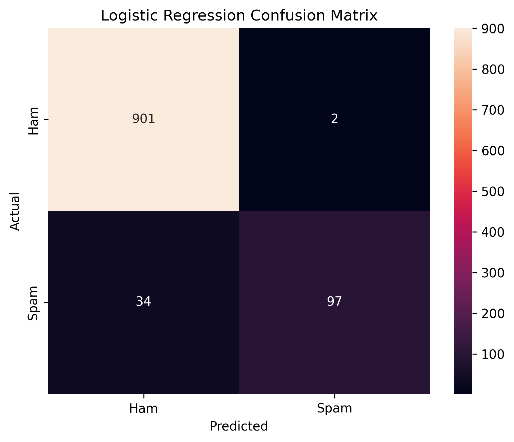

# 📩 Spam SMS & Email Classifier

A machine learning and natural language processing project that classifies SMS and email messages as **Spam** or **Not Spam**.

The project uses **TF-IDF with unigrams and bigrams** and compares multiple machine learning classification algorithms before deploying the final model using **Streamlit**.

---

## 📌 Project Overview

Spam messages can contain unwanted advertisements, suspicious links, fraudulent offers, or other unwanted content.

The goal of this project is to build a machine learning system that analyzes a text message and predicts whether it is:

- 🟢 Not Spam
- 🔴 Spam

The project follows an end-to-end machine learning workflow:

**Data Cleaning → Text Preprocessing → Feature Engineering → TF-IDF → Model Training → Model Comparison → Evaluation → Streamlit Deployment**

---

## 🎯 Objectives

- Clean and preprocess text messages
- Convert text into numerical features using TF-IDF
- Use unigrams and bigrams for text representation
- Train multiple classification models
- Compare model performance
- Evaluate models using classification metrics
- Analyze classification errors
- Build an interactive Streamlit application

---

## 📊 Dataset

The project uses the **SMS Spam Collection Dataset**.

The messages are classified into two categories:

- `ham` → Not Spam
- `spam` → Spam

The original dataset contains some unused columns, so only the relevant message and label columns were retained.

Duplicate messages were also removed before training.

---

## 🔄 Methodology

### 1. Text Preprocessing

The following preprocessing steps were applied:

- Convert text to lowercase
- Remove URLs
- Remove email addresses
- Remove numbers
- Remove punctuation
- Remove extra spaces

### 2. Feature Engineering

Additional message-level features were explored:

- Message length
- Word count

### 3. TF-IDF

The cleaned messages were converted into numerical features using **TF-IDF (Term Frequency-Inverse Document Frequency)**.

The vectorizer uses:

python
TfidfVectorizer(
    max_features=5000,
    ngram_range=(1, 2),
    min_df=2,
    sublinear_tf=True
)


Both **unigrams and bigrams** are used to capture individual words as well as combinations of words.

The TF-IDF vectorizer was fitted only on the training data to avoid data leakage.

---

## 🤖 Models Used

Three machine learning classification algorithms were trained and compared:

### Multinomial Naive Bayes

A probabilistic algorithm commonly used for text classification.

### Logistic Regression

A linear classification algorithm that also provides probability estimates.

Logistic Regression was selected for the final Streamlit application because it provides probability predictions that can be displayed to the user.

### Linear SVM

A linear Support Vector Machine suitable for high-dimensional text classification.

---

## 📈 Model Evaluation

The models were evaluated using:

* Accuracy
* Precision
* Recall
* F1 Score
* ROC-AUC

Additional analysis included:

* Confusion Matrix
* ROC Curve
* Error Analysis
* Spam probability analysis
* False Positive and False Negative analysis

---

## 📊 Model Comparison

The following chart compares the performance of the three trained models.



---

## 🔲 Confusion Matrix

The confusion matrix shows the classification results of the final Logistic Regression model.



---

## 🌐 Streamlit Application

The trained Logistic Regression model and TF-IDF vectorizer were saved using `joblib`.

The Streamlit application allows users to enter an SMS or email message and provides:

* Spam / Not Spam prediction
* Spam probability
* Legitimate probability
* Character count
* Word count
* URL detection
* Basic message indicators

### 🚨 Spam Prediction


### ✅ Normal Message Prediction


---

## 🛠️ Technologies Used

* Python
* Pandas
* NumPy
* Scikit-learn
* Matplotlib
* Seaborn
* Joblib
* Streamlit
* Natural Language Processing
* TF-IDF

---

## 📁 Project Structure

text
spam_message_classifier/
│
├── data/
│   └── spam.csv
│
├── models/
│   ├── spam_classifier.pkl
│   ├── tfidf_vectorizer.pkl
│   └── text_preprocessor.py
│
├── notebooks/
│   └── Spam_SMS_Email_Classifier.ipynb
│
├── screenshots/
│   ├── spam_prediction.png
│   ├── normal_prediction.png
│   ├── model_comparison.png
│   └── confusion_matrix.png
│
├── app.py
├── requirements.txt
├── README.md
└── .gitignore
```

---

## ⚙️ Installation & Setup

Clone the repository:

```bash
git clone <your-repository-url>
```

Move into the project folder:

```bash
cd spam_message_classifier
```

Install the required dependencies:

```bash
pip install -r requirements.txt
```

---

## ▶️ Run the Application

Start the Streamlit application using:

```bash
python -m streamlit run app.py
```

The application will open in your browser.

Usually, it will be available at:

```text
http://localhost:8501
```

---

## 👩‍💻 Author

**Shubhashree R. Gouda**
